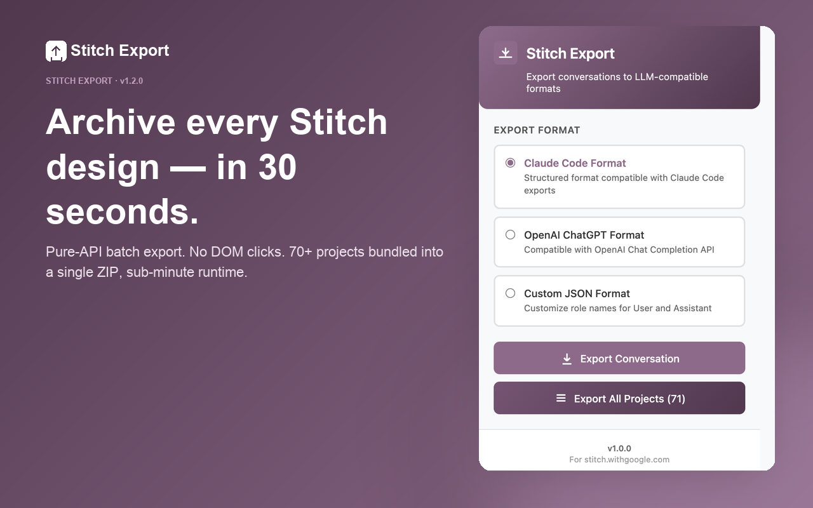
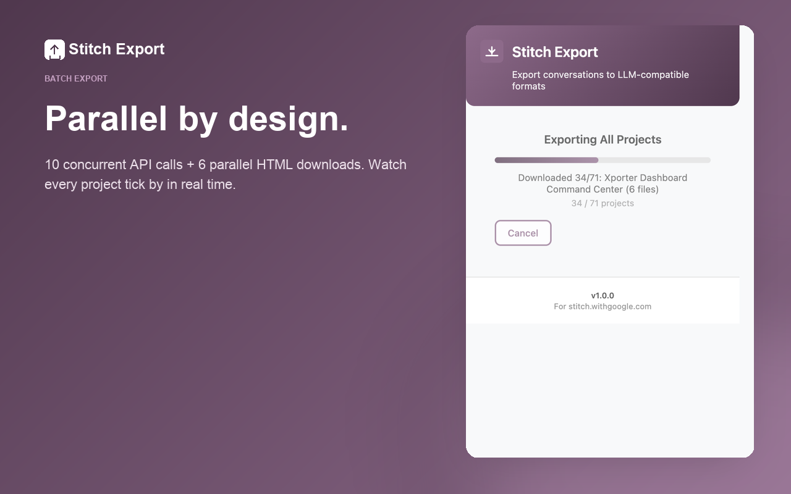
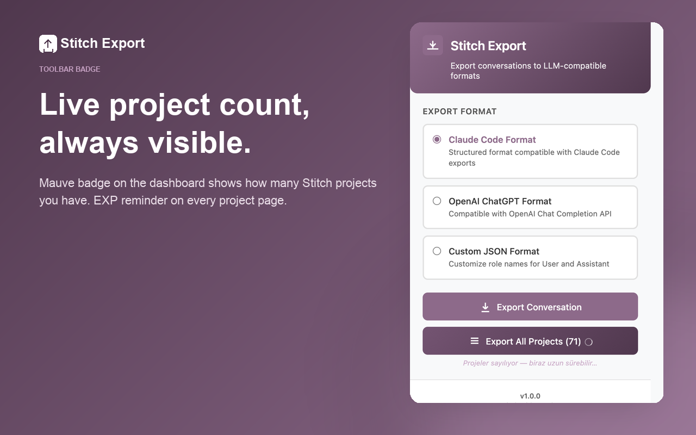

# Stitch Export

> Archive every conversation and design from [stitch.withgoogle.com](https://stitch.withgoogle.com) — in 30 seconds.

[](https://github.com/nsozturk/stitch-export/releases/latest)
[](LICENSE)
[](https://github.com/nsozturk/stitch-export/releases)
[](https://github.com/nsozturk/stitch-export/commits/main)




Stitch Export is a Chrome extension that exports your conversations and
generated designs from Google Stitch to LLM-compatible JSON formats (Claude
Code, ChatGPT) and ZIP archives with the full per-turn design history.

## Features

- **Single-project export** — current conversation as structured JSON
  (Claude Code / OpenAI ChatGPT / custom-role formats)
- **Batch export** — every Stitch project in one ZIP, in ~30 seconds for
  70+ projects (24× faster than v1.1.x — uses Stitch's own API directly,
  no DOM automation)
- **Rich chat export** — every assistant turn includes references to the
  designs it generated and the follow-up suggestion prompts
- **Toolbar icon badge** — project count on the Stitch dashboard, "EXP"
  reminder on project pages
- **In-page button** — Export button injected directly into Stitch's
  toolbar
- **Context menu** — right-click → Export
- **Local-only processing** — no data leaves your browser



## Installation

### Chrome Web Store

> v1.2.0 currently in review.

### Developer Mode (unpacked, until Store review completes)

1. Download the latest ZIP: [stitch-export-1.2.0.zip](https://github.com/nsozturk/stitch-export/releases/latest)
2. Unzip somewhere on disk
3. Open `chrome://extensions/`
4. Enable **Developer Mode** (top-right)
5. Click **Load unpacked** → select the unzipped folder

## Usage

### Single conversation

1. Open a Stitch project: `https://stitch.withgoogle.com/projects/{ID}`
2. Click the Stitch Export icon (or right-click → Export Stitch Conversation)
3. Choose a format → **Export Conversation** → JSON saved to Downloads

### Batch export all projects



1. Click the Stitch Export icon on **any** Stitch tab — the icon shows
   the project count as a badge
2. Click **Export All Projects (NN)** in the popup
3. The extension fetches every project via Stitch's API in one tab and
   downloads every design HTML directly from Google's CDN
4. A single ZIP is downloaded with this layout per project:

   ```
   stitch-all-projects-2026-05-15/
   └── ProjectName_<id>/
       ├── chat.json                              ← rich per-turn metadata
       ├── screens/
       │   ├── My_Screen_2cde0644.html            ← final state (from ErneX)
       │   └── ...
       └── history/
           ├── turn-001-design-prompt-for-…/
           │   ├── My_Screen_2cde0644.html        ← screens generated in turn 1
           │   └── ...
           └── turn-002-add-ghost-mode/
               └── ...
   ```

### What's in `chat.json`

```json
{
  "projectId": "...",
  "projectTitle": "...",
  "exportedAt": "2026-05-15T...",
  "finalScreens": [
    {
      "name": "My Screen",
      "uid": "2cde0644...",
      "file": "screens/My_Screen_2cde0644.html",
      "screenshotUrl": "https://lh3.googleusercontent.com/..."
    }
  ],
  "turns": [
    {
      "index": 1,
      "user":      { "content": "Design a..." },
      "assistant": {
        "content": "The interface has been designed...",
        "generatedScreens": [
          { "name": "...", "uid": "...", "file": "history/turn-001-…/...html" }
        ],
        "suggestions": [
          "Design the Ghost Mode screen.",
          "Change accent to neon green.",
          "..."
        ]
      }
    }
  ]
}
```

## Export formats

### Claude Code

```json
{
  "conversation": {
    "title": "...",
    "created_at": "...",
    "messages": [
      { "role": "user", "content": "..." },
      { "role": "assistant", "content": "..." }
    ]
  }
}
```

### OpenAI ChatGPT

```json
{
  "messages": [
    { "role": "user", "content": "..." },
    { "role": "assistant", "content": "..." }
  ]
}
```

### Custom

Pick the role names yourself (e.g. `Human` / `Model`).

## Permissions

| Permission | What it's for |
|---|---|
| `activeTab` + `scripting` | Inject the export script into the current Stitch tab |
| `tabs` | Open one background tab for batch export; detect Stitch URLs for the toolbar badge |
| `contextMenus` | Right-click → Export Stitch Conversation |
| `downloads` | Save the JSON / ZIP to your Downloads folder |
| Host: `stitch.withgoogle.com`, `*.appspot.com`, `contribution.usercontent.google.com`, `lh3.googleusercontent.com` | API + design CDN access |

## Privacy

- **No external servers** — exports are local downloads only
- **No analytics, no telemetry, no tracking**
- The extension reads your existing Stitch login session via standard
  browser cookies; passwords and session tokens are never read or
  transmitted
- All network requests go to Google's own domains (Stitch API, Google
  content CDN). The extension has no servers of its own.

## Development

No build step. Load the folder in Developer Mode and refresh the Stitch
page after changes.

```bash
# Syntax check
node -c background.js && node -c content.js && node -c popup/popup.js

# Regenerate doc HTML wrappers after editing any docs/stores/*/README.md
python3 docs/stores/scripts/render-docs.py

# Capture popup screenshots (requires puppeteer locally)
node screenshots/capture-puppeteer.js

# Regenerate Chrome Web Store marketing assets (requires Pillow)
python3 screenshots/gen-store-assets.py
```

## Release / publishing

See [docs/stores/ChromeWebStore/](docs/stores/ChromeWebStore/index.html)
for the full 8-phase Chrome Web Store launch guide. Quick links:

- [Master checklist](docs/stores/ChromeWebStore/README.md)
- [Package prep](docs/stores/ChromeWebStore/02-package-prep/README.md)
- [Store listing](docs/stores/ChromeWebStore/04-store-listing/README.md)
- [Privacy & permissions](docs/stores/ChromeWebStore/06-privacy-permissions/README.md)

## License

MIT — see [LICENSE](LICENSE).

## Disclaimer

Unofficial extension. Not affiliated with Google or Stitch.
